<div align="center">

<br>

<picture>
  <source media="(prefers-color-scheme: dark)" srcset="assets/logo/steward-mark-light.svg">
  <source media="(prefers-color-scheme: light)" srcset="assets/logo/steward-mark.svg">
  
</picture>

<br>
<br>

# Steward Brand

**Design system, component library, and brand tokens for the Steward church management platform.**

<br>

[Brand Guide](https://24skater.github.io/steward-brand/examples/) &nbsp;·&nbsp; [Tokens](packages/tokens) &nbsp;·&nbsp; [Components](packages/ui) &nbsp;·&nbsp; [Get Started](#quick-start)

<br>


[](https://24skater.github.io/steward-brand/examples/)

<br>
<br>

</div>

---

## Contents

- [Design System in Action](#design-system-in-action)
- [What's in the Box](#whats-in-the-box)
- [Token Pipeline](#token-pipeline)
- [Product Themes](#product-themes)
- [Quick Start](#quick-start)
- [Using Tokens](#using-tokens)
- [Using Components](#using-components)
- [Email Templates](#email-templates)
- [Brand Guide](#brand-guide)
- [Development](#development)
- [Contributing](#contributing)

---

## Design System in Action

The brand guide captures every token, component, and pattern in one place — with live light and dark mode:

<table>
<tr>
<td width="50%">
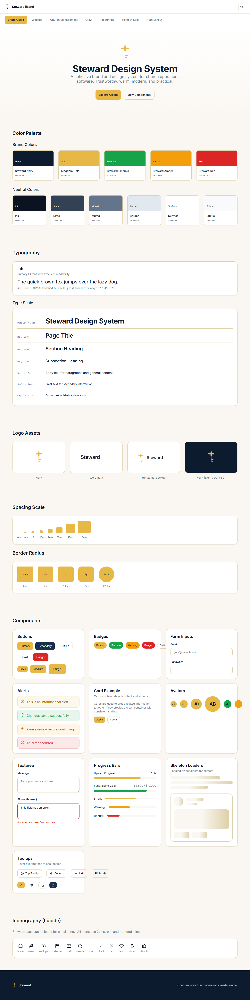
</td>
<td width="50%">
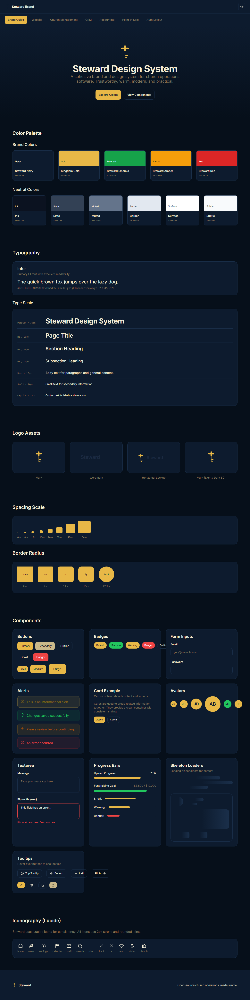
</td>
</tr>
<tr>
<td align="center"><sub>Light mode</sub></td>
<td align="center"><sub>Dark mode</sub></td>
</tr>
</table>

The auth layout ships as a composable React component — drop it in and both themes work out of the box:

<table>
<tr>
<td width="50%">
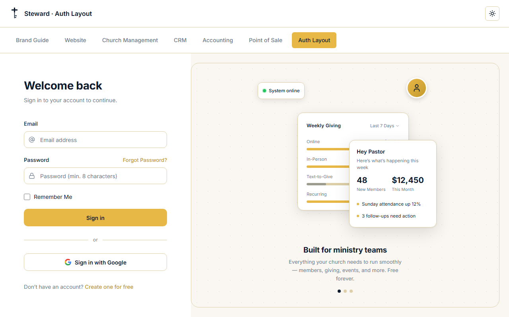
</td>
<td width="50%">
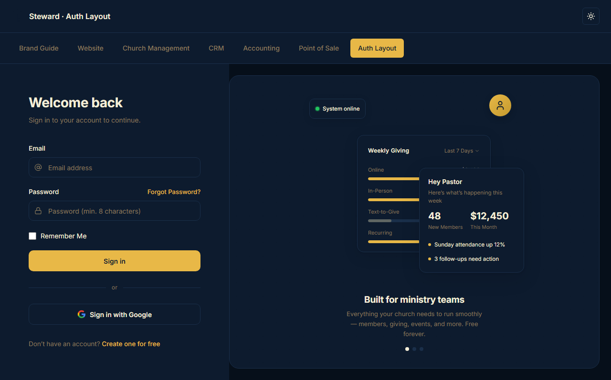
</td>
</tr>
<tr>
<td align="center"><sub>Light mode</sub></td>
<td align="center"><sub>Dark mode</sub></td>
</tr>
</table>

---

## What's in the Box

Six packages — one shared design language across every Steward product:

| Package | Contents | Key exports |
|---|---|---|
| [`@steward-apps/tokens`](packages/tokens) | DTCG design tokens compiled to CSS variables, JS, and JSON | `tokens.css`, `tokens.js`, `themes/*.css` |
| [`@steward-apps/ui`](packages/ui) | 25+ React components built on Radix UI + Tailwind v4 | `Button`, `Sidebar`, `Pagination`, `Combobox`, … |
| [`@steward-apps/icons`](packages/icons) | Ministry-specific SVG icon set | `GivingIcon`, `AttendanceIcon`, `PrayerIcon`, … |
| [`@steward-apps/email-templates`](packages/email-templates) | Inline-style HTML email templates | `welcomeEmail`, `receiptEmail`, `passwordResetEmail` |
| [`@steward-apps/eslint-config`](packages/eslint-config) | Shared ESLint configuration | `base`, `react` |
| [`@steward-apps/tsconfig`](packages/tsconfig) | Shared TypeScript configurations | `base.json`, `library.json`, `react.json` |

---

## Token Pipeline

Tokens are written once in [DTCG format](https://design-tokens.github.io/community-group/format/) and compiled to every output format the platform needs:

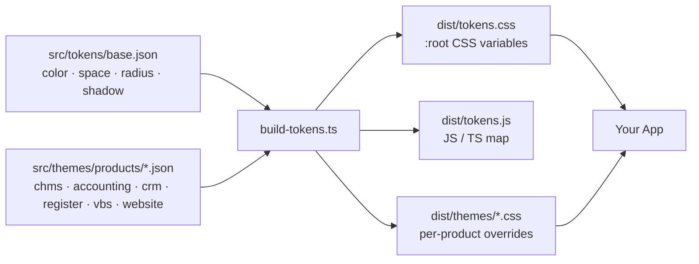

The CSS output covers both light and dark mode automatically — no JavaScript required:

```css
/* Base layer: dist/tokens.css */
:root {
  --st-primary:  #E8B847;   /* Kingdom Gold */
  --st-fg:       #0D1B2E;   /* Navy foreground */
  --st-bg:       #FAF7F2;   /* Parchment background */
  --st-surface:  #FFFFFF;   /* Card / panel surface */
  --st-border:   #DDD0A8;
  --st-muted:    #6B7A8D;
}

.dark {
  --st-fg:       #F5EED8;
  --st-bg:       #060F1A;
  --st-surface:  #0D1B2E;
  --st-border:   #1A2F4A;
  --st-muted:    #8A7A5C;
}
```

New theme files dropped into `packages/tokens/src/themes/products/` are auto-discovered at build time — no script changes needed.

---

## Product Themes

One token foundation, six product surfaces. Each theme scopes a handful of CSS variable overrides — everything else inherits from the base layer:

<table>
<tr>
<td width="50%">
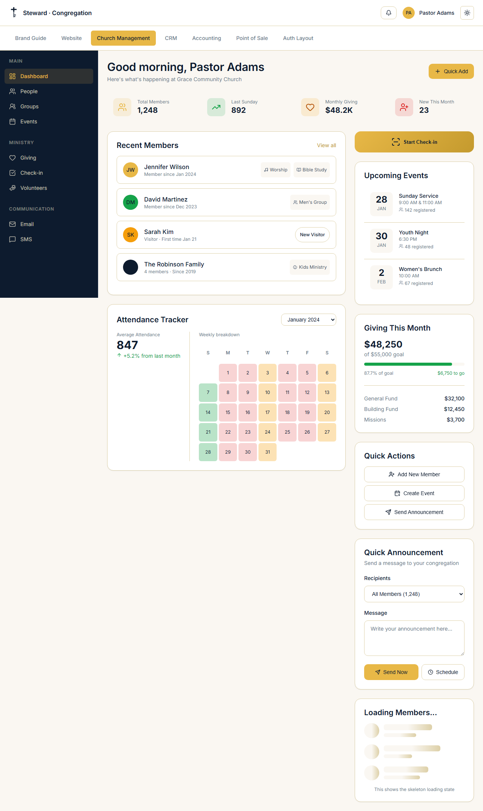
<p align="center"><strong>ChMS</strong> &nbsp;—&nbsp; <sub>Warm navy · parchment · Kingdom Gold</sub></p>
</td>
<td width="50%">
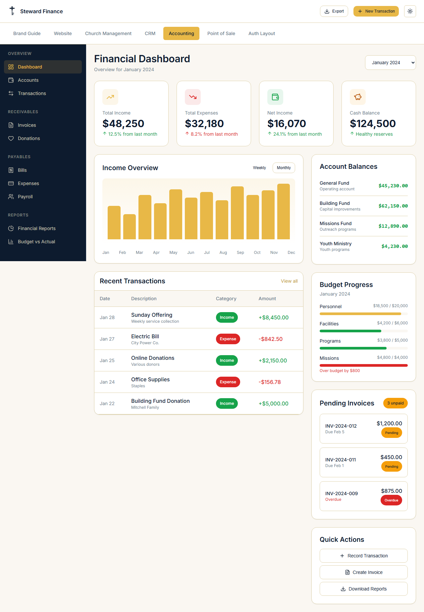
<p align="center"><strong>Accounting</strong> &nbsp;—&nbsp; <sub>Cool slate · blue accent</sub></p>
</td>
</tr>
<tr>
<td width="50%">
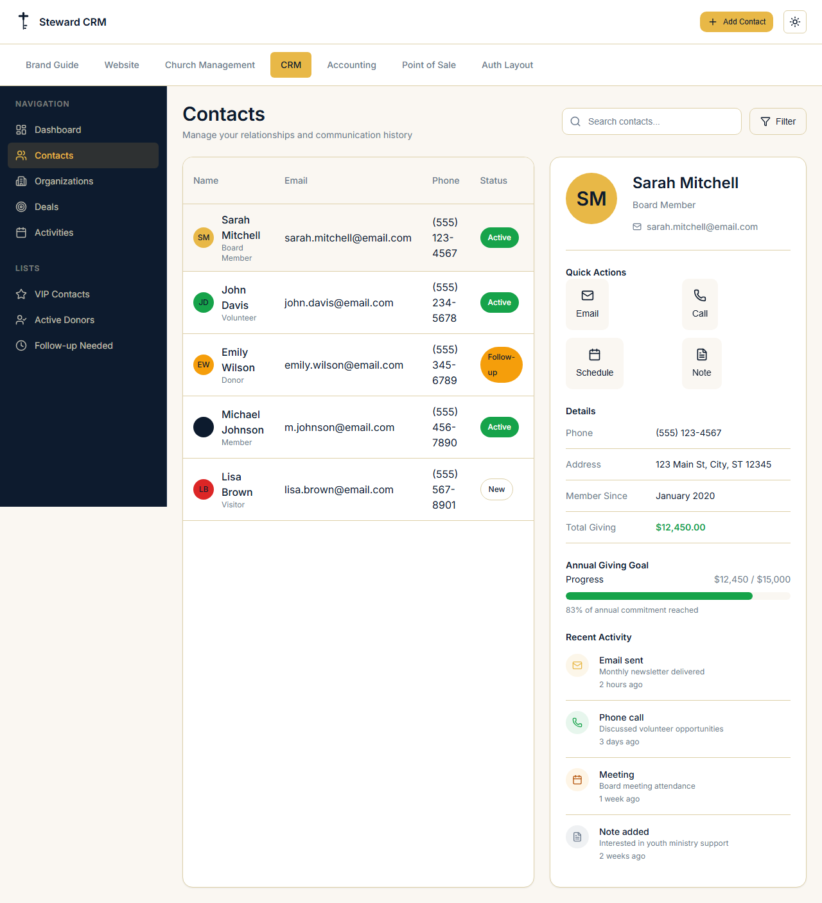
<p align="center"><strong>CRM</strong> &nbsp;—&nbsp; <sub>Warm stone · emerald accent</sub></p>
</td>
<td width="50%">
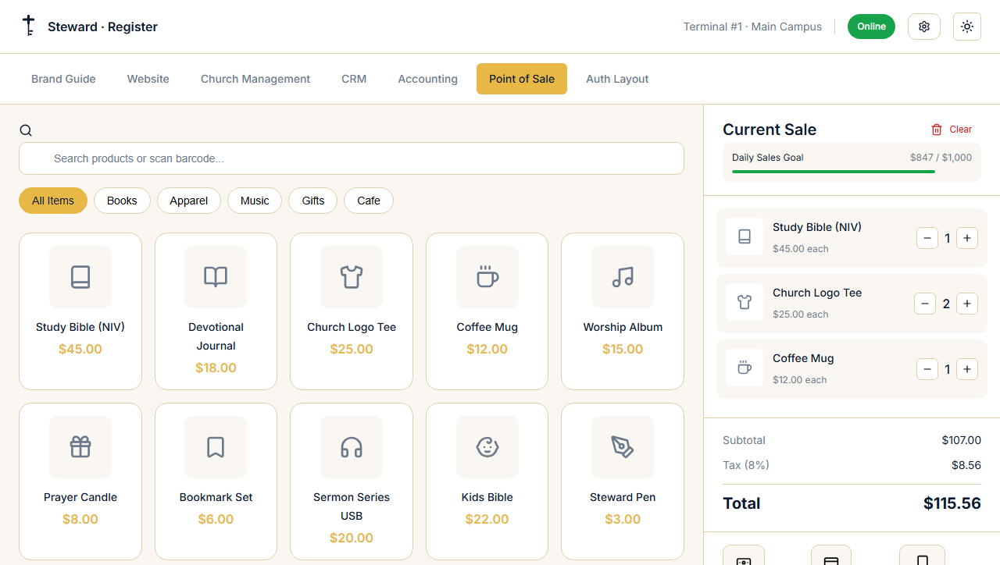
<p align="center"><strong>Point of Sale</strong> &nbsp;—&nbsp; <sub>High-contrast · transaction-focused</sub></p>
</td>
</tr>
</table>

<table>
<tr>
<td width="50%">
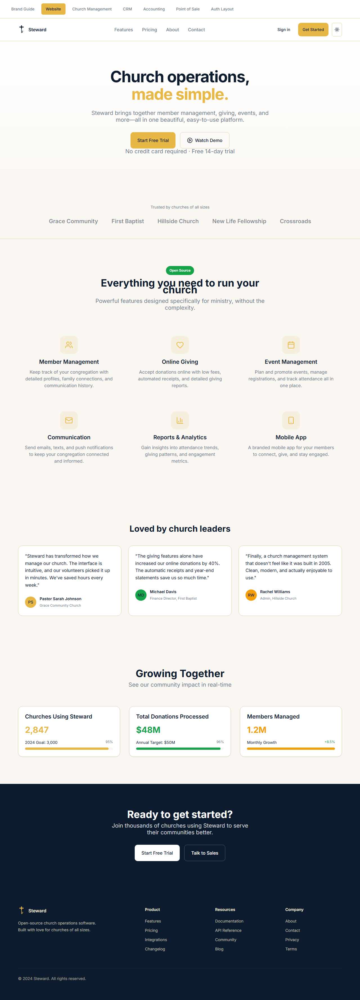
<p align="center"><strong>Website</strong> &nbsp;—&nbsp; <sub>Full brand parchment</sub></p>
</td>
<td width="50%">
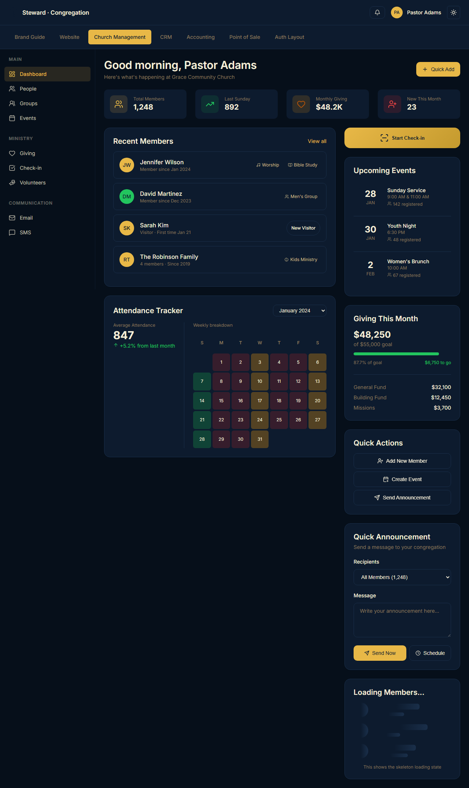
<p align="center"><strong>ChMS</strong> &nbsp;—&nbsp; <sub>Dark mode</sub></p>
</td>
</tr>
</table>

Apply a theme with one import and one attribute:

```html
<link rel="stylesheet" href="@steward-apps/tokens/dist/themes/chms.css" />
<body data-product="chms">
  <!-- all --st-* variables now reflect the ChMS palette -->
</body>
```

| Theme file | Product | Palette |
|---|---|---|
| `themes/chms.css` | Church Management | Navy sidebar, parchment, Kingdom Gold |
| `themes/accounting.css` | Finance / Ledger | Cool slate, blue accent |
| `themes/crm.css` | Contacts / Relationships | Warm stone, emerald accent |
| `themes/register.css` | Point of Sale | High-contrast transaction UI |
| `themes/vbs.css` | Youth / VBS | Vibrant, playful |
| `themes/website.css` | Public marketing site | Full parchment brand |

---

## Quick Start

**Requirements:** Node.js 20+ · pnpm 9+

```bash
git clone https://github.com/steward-org/steward-brand.git
cd steward-brand
pnpm install && pnpm build
```

To install individual packages in your app:

```bash
pnpm add @steward-apps/tokens @steward-apps/ui
```

<details>
<summary>Installing individual packages</summary>

```bash
# Tokens only (CSS variables, no React dependency)
pnpm add @steward-apps/tokens

# UI components (requires React 18+ and Tailwind v4)
pnpm add @steward-apps/ui

# Ministry icons
pnpm add @steward-apps/icons

# Email templates (framework-agnostic HTML strings)
pnpm add @steward-apps/email-templates
```

</details>

---

## Using Tokens

```css
/* 1. Base token layer — light and dark mode variables */
@import '@steward-apps/tokens/dist/tokens.css';

/* 2. Optional: load a product theme */
@import '@steward-apps/tokens/dist/themes/chms.css';
```

```tsx
/* Tokens are plain CSS variables — use them anywhere */
function StatCard({ label, value }: { label: string; value: string }) {
  return (
    <div style={{
      background: 'var(--st-surface)',
      border: '1px solid var(--st-border)',
      borderRadius: '8px',
      padding: '1.5rem',
    }}>
      <p style={{ color: 'var(--st-muted)', fontSize: '0.875rem' }}>{label}</p>
      <p style={{ color: 'var(--st-fg)', fontSize: '1.5rem', fontWeight: 600 }}>{value}</p>
    </div>
  );
}
```

Or import the typed JavaScript map:

```ts
import tokens from '@steward-apps/tokens';

tokens.color.brand.gold    // "#E8B847"
tokens.color.brand.navy    // "#0D1B2E"
tokens.space.lg            // "1.5rem"
```

Configure Tailwind to reference the same variables:

```js
// tailwind.config.js
import stewardPreset from '@steward-apps/ui/tailwind.preset';

export default {
  presets: [stewardPreset],
};
```

---

## Using Components

```bash
pnpm add @steward-apps/ui
```

```tsx
import '@steward-apps/ui/styles';
import { Button, Input, Card, CardContent, Pagination, Combobox } from '@steward-apps/ui';
import { useState } from 'react';

export function MemberSearch() {
  const [page, setPage] = useState(1);
  const [ministry, setMinistry] = useState('');

  return (
    <Card>
      <CardContent className="space-y-4">
        <Combobox
          options={ministries}
          value={ministry}
          onChange={setMinistry}
          placeholder="Filter by ministry…"
        />
        <Input type="search" placeholder="Search members…" />
        <Button>Search</Button>
        <Pagination totalPages={12} currentPage={page} onPageChange={setPage} />
      </CardContent>
    </Card>
  );
}
```

### Sidebar

The sidebar system reads from `--st-sidebar-*` CSS variables so it adopts each product theme automatically:

```tsx
import {
  Sidebar, SidebarHeader, SidebarContent, SidebarFooter,
  SidebarSection, SidebarSectionTitle, SidebarLink, SidebarSeparator,
} from '@steward-apps/ui';
import { Users, DollarSign, Calendar, Settings } from 'lucide-react';

export function AppSidebar({ path }: { path: string }) {
  return (
    <Sidebar>
      <SidebarHeader>
        
        <span className="font-semibold">Steward · ChMS</span>
      </SidebarHeader>

      <SidebarContent>
        <SidebarSection>
          <SidebarSectionTitle>Ministry</SidebarSectionTitle>
          <SidebarLink href="/members" icon={<Users />} active={path === '/members'}>
            Members
          </SidebarLink>
          <SidebarLink href="/giving" icon={<DollarSign />} active={path === '/giving'}>
            Giving
          </SidebarLink>
          <SidebarLink href="/events" icon={<Calendar />} active={path === '/events'}>
            Events
          </SidebarLink>
        </SidebarSection>

        <SidebarSeparator />

        <SidebarSection>
          <SidebarLink href="/settings" icon={<Settings />} active={path === '/settings'}>
            Settings
          </SidebarLink>
        </SidebarSection>
      </SidebarContent>

      <SidebarFooter>
        <span className="text-sm">Pastor James</span>
      </SidebarFooter>
    </Sidebar>
  );
}
```

<details>
<summary>Full component reference (25+ components)</summary>

**Layout**

| Component | Description |
|---|---|
| `AuthLayout` `AuthForm` `AuthPanel` `AuthDivider` | Login / sign-up page shell |
| `Sidebar` `SidebarHeader` `SidebarContent` `SidebarFooter` | App navigation sidebar |
| `SidebarSection` `SidebarSectionTitle` `SidebarLink` `SidebarSeparator` | Sidebar internals |

**Forms**

| Component | Description |
|---|---|
| `Button` | Primary, outline, ghost, destructive variants |
| `Input` `Textarea` `Label` `FormField` `FormFieldRow` | Text inputs and field wrappers |
| `Select` | Native-enhanced select via Radix UI |
| `Checkbox` `Switch` | Toggle controls |
| `CurrencyInput` | Locale-aware currency field with format-on-blur |
| `Combobox` | Searchable select — no external popover dependency |

**Feedback & Overlay**

| Component | Description |
|---|---|
| `Alert` `AlertTitle` `AlertDescription` | Inline status banners |
| `Badge` | Colored status labels |
| `Toast` `ToastProvider` `ToastViewport` | Notification toasts |
| `Spinner` | Accessible loading indicator (xs – xl) |
| `Skeleton` `Progress` | Loading states |
| `Dialog` `ConfirmDialog` | Modal dialogs |
| `Tooltip` | Hover / focus tooltips |

**Data Display**

| Component | Description |
|---|---|
| `Table` `TableHeader` `TableBody` `TableRow` `TableCell` `TableCaption` | Data table |
| `Pagination` | Ellipsis-aware page navigation |

**Navigation**

| Component | Description |
|---|---|
| `Tabs` `TabsList` `TabsTrigger` `TabsContent` | Horizontal tab panels |
| `DropdownMenu` | Accessible dropdown via Radix UI |
| `Breadcrumb` | Path trail with aria-current |

**Containers**

| Component | Description |
|---|---|
| `Card` `CardHeader` `CardContent` `CardFooter` | Surface containers |
| `Avatar` `AvatarImage` `AvatarFallback` | User avatar with fallback initials |

</details>

---

## Email Templates

Framework-agnostic — every template returns a plain HTML string you pass directly to any email provider:

```bash
pnpm add @steward-apps/email-templates
```

```ts
import { welcomeEmail, receiptEmail, passwordResetEmail } from '@steward-apps/email-templates';

// New member onboarding
const welcome = welcomeEmail({
  organizationName: 'Grace Community Church',
  recipientName:    'Sarah',
  ctaUrl:           'https://app.steward.com/onboarding',
});

// Giving receipt
const receipt = receiptEmail({
  organizationName: 'Grace Community Church',
  recipientName:    'John',
  amount:           150,
  date:             '2024-06-15',
  transactionId:    'TXN-4521',
});

// Password reset
const reset = passwordResetEmail({
  organizationName: 'Grace Community Church',
  recipientName:    'Sarah',
  resetUrl:         'https://app.steward.com/reset?token=abc123',
  expiresInMinutes: 60,
  supportEmail:     'help@gracechurch.com',
});

// Pass to any provider — Resend, Postmark, SendGrid, Nodemailer, etc.
await resend.emails.send({ to, subject, html: welcome });
```

| Template | Function | Required props |
|---|---|---|
| Welcome | `welcomeEmail()` | `organizationName` · `recipientName` · `ctaUrl` |
| Giving Receipt | `receiptEmail()` | `organizationName` · `recipientName` · `amount` · `date` |
| Password Reset | `passwordResetEmail()` | `organizationName` · `recipientName` · `resetUrl` |

---

## Brand Guide

### Color Palette

| Swatch | Token | Value | Use |
|:---:|---|---|---|
|  | `--st-fg` | `#0D1B2E` | Foreground · Navy |
|  | `--st-primary` | `#E8B847` | Kingdom Gold · actions · highlights |
|  | `--st-bg` | `#FAF7F2` | Parchment · page background |
|  | `--st-surface` | `#FFFFFF` | Card · panel surface |
|  | `--st-border` | `#DDD0A8` | Borders |
|  | `--st-muted` | `#6B7A8D` | Secondary text |

Dark mode inverts the surface and background tokens on `.dark` automatically — no per-component overrides needed.

### Typography

**Inter** across all products. `Inter, system-ui, -apple-system, sans-serif`

| Scale | Size | Weight | Where it's used |
|---|---|---|---|
| Display | 36px | 700 | Hero headlines |
| H1 | 30px | 600 | Page titles |
| H2 | 24px | 600 | Section headers |
| H3 | 20px | 500 | Card titles |
| Body | 16px | 400 | Primary content |
| Small | 14px | 400 | Secondary text, labels |
| Caption | 12px | 400 | Metadata, timestamps |

### Logo System

<table>
<tr>
<td align="center" width="25%">
<br>

<br><br>
<strong>Mark</strong><br>
<sub>Favicons · app icons</sub>
<br><br>
</td>
<td align="center" width="25%">
<br>

<br><br>
<strong>Wordmark</strong><br>
<sub>Space-constrained headers</sub>
<br><br>
</td>
<td align="center" width="25%">
<br>

<br><br>
<strong>Horizontal lockup</strong><br>
<sub>Marketing · headers</sub>
<br><br>
</td>
<td align="center" width="25%">
<br>

<br><br>
<strong>Stacked lockup</strong><br>
<sub>Square / social formats</sub>
<br><br>
</td>
</tr>
</table>

**Logo rules:** maintain clear space equal to the mark height on all sides · minimum wordmark width 120px · never stretch, rotate, recolor, or add effects.

### Product Naming

In app headers, use the dot-separator format: `Steward · ChMS`

| Product | Name |
|---|---|
| Church Management | Steward ChMS |
| Point of Sale | Steward Register |
| Finance / Ledger | Steward Accounting |
| Contacts | Steward CRM |
| Youth Programming | Steward VBS |
| Marketing Site | Steward Website |

### Voice & Tone

Speak like a helpful teammate — not enterprise software.

| Write this | Not this |
|---|---|
| "Saved." | "Your changes have been successfully saved to the database." |
| "Member updated." | "Member record modification complete." |
| "Add an email to continue." | "Error: Required field 'email' is empty." |
| "Payment recorded." | "Transaction #4521 has been processed." |

Calm. Clear. Helpful. The product fades into the background so ministry can shine.

### Favicon & App Icons

Pre-built SVG favicons live in `assets/favicon/`. Copy them to your `public/` directory:

```html
<link rel="icon"             href="/favicon.svg" type="image/svg+xml" />
<link rel="icon"             href="/favicon-32.svg" sizes="32x32" />
<link rel="apple-touch-icon" href="/apple-touch-icon.svg" />
<link rel="manifest"         href="/site.webmanifest" />
```

---

## Development

### Monorepo Commands

```bash
pnpm build            # Build all packages
pnpm dev              # Watch all packages
pnpm typecheck        # Type-check all packages
pnpm lint             # Lint all packages
pnpm format           # Format with Prettier
```

### Testing

```bash
# Unit tests — Vitest + Testing Library
pnpm test

# With coverage report (threshold: 80%)
pnpm test:coverage

# Interactive test UI
pnpm --filter @steward-apps/ui test:ui

# Screenshot baseline — captures new / updates changed
pnpm screenshots

# Visual regression — diffs against baseline
pnpm screenshots:compare
```

| Suite | Framework | Coverage |
|---|---|---|
| Component unit tests | Vitest + Testing Library | 42 tests across Spinner · Breadcrumb · Pagination · Sidebar · Combobox · CurrencyInput |
| Visual regression | Playwright | 14 screenshots — 7 pages × light + dark |

### Adding a Component

```bash
# 1. Create the component
touch packages/ui/src/components/MyComponent.tsx

# 2. Export it from the package index
# → packages/ui/src/index.ts

# 3. Add unit tests
touch packages/ui/src/__tests__/MyComponent.test.tsx

# 4. Verify
pnpm --filter @steward-apps/ui build
pnpm test
```

### Adding a Product Theme

```bash
# 1. Create the theme JSON
touch packages/tokens/src/themes/products/my-product.json

# 2. Build — theme is auto-discovered, no script changes needed
pnpm --filter @steward-apps/tokens build

# → packages/tokens/dist/themes/my-product.css
```

---

## Contributing

See [CONTRIBUTING.md](CONTRIBUTING.md) for the full guide.

```bash
git clone https://github.com/steward-org/steward-brand.git
cd steward-brand
pnpm install
pnpm build
pnpm test
```

For major changes — new components, theme architecture, token naming — open an issue first so the approach can be aligned before the work begins.

---

<div align="center">

<br>

<picture>
  <source media="(prefers-color-scheme: dark)" srcset="assets/logo/steward-mark-light.svg">
  <source media="(prefers-color-scheme: light)" srcset="assets/logo/steward-mark.svg">
  
</picture>

<br>
<br>

[MIT License](./LICENSE) &nbsp;·&nbsp; Built with care for the local church.

<br>
<br>

</div>
